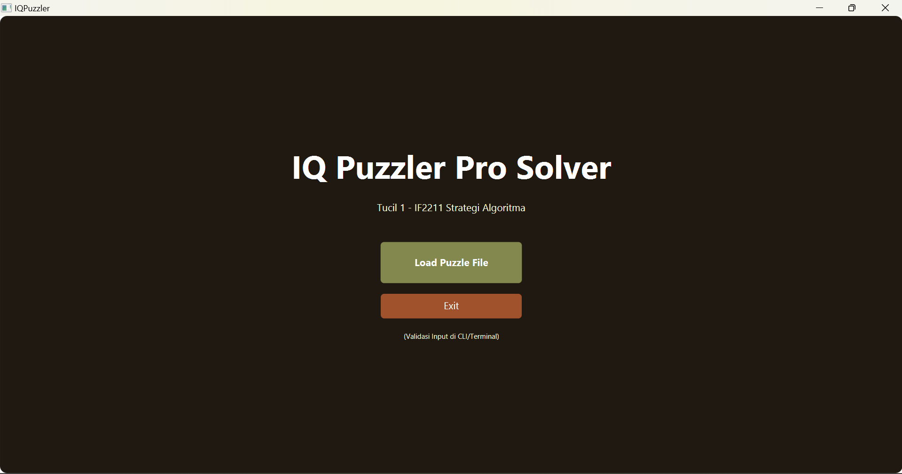
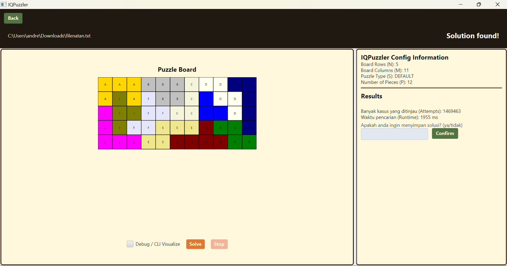
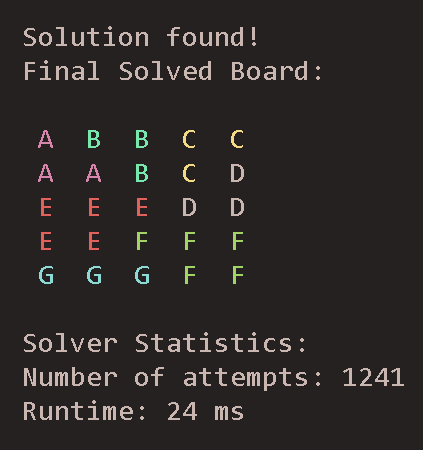
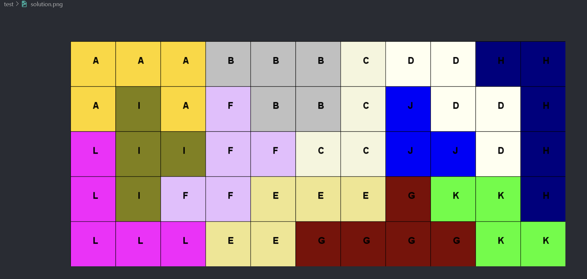
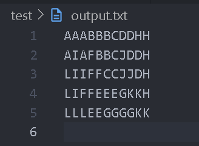

# Tucil1_13523148

> Tugas Kecil 1 IF2211 Strategi Algoritma - Penyelesaian IQ Puzzler Pro dengan Algoritma Brute Force

## Table of Contents

-   [Description](#description)
-   [Features](#features)
-   [Screenshots](#screenshots)
-   [How to Run](#how-to-run)
-   [Bonus Status](#bonus-status)
-   [Technologies Used](#technologies-used)
-   [Room for Improvement](#room-for-improvement)
-   [Authors](#authors)

## 📝 Description

This project is a solution finder for the IQ Puzzler Pro game implemented using a pure Bruteforce Algorithm in Java. The goal of IQ Puzzler Pro is to fill an empty board of (N x M) with uniquely shaped puzzle pieces, ensuring all pieces are used without heuristics. The program reads the input and test case files (.txt), finds a valid configuration (or report validation in terminal if none exists), and provides solution/execution details such as runtime, iteration/cases count, and a feature for file saving. This project is made both in CLI and GUI with (Maven and JavaFX).

## 🪛 Pre-requisites

-   **Running Java**: JDK 11 or higher (tested on JDK 17)
-   **Running Java supported IDE**: IDE for building project (IntelliJ IDEA, Eclipse, VSCode)
-   **Running OS**: compatible with Windows and Linux
-   **Maven**: For dependency management

## 🏃‍♂️How to Run

1. **Install Java**: Download and install Java from [here](https://www.oracle.com/java/technologies/downloads/).
2. **Install Maven**: Download and install Maven from [here](https://maven.apache.org/download.cgi).
3. **Clone the Repository**: Use one of the following commands to clone the repository:

    ```bash
    git clone https://github.com/andrewtedja/Tucil1_13523148.git
    ```

4. **Build the Project**: Navigate to the project directory and run the following command to build the project:

    ```bash
    mvn clean install
    ```

5. **Run the Project**: Navigate to the project directory and run the following command to run the project:

    ```bash
    mvn javafx:run
    ```

## Features

-   Reading file input upload from (.txt) file
-   Solving the IQPuzzler Pro using Brute force Algorithm
-   Showing information on board size (rows, columns), type of puzzle (Default/Custom/Pyramid), and the number of puzzle pieces
-   Show the solving process in both GUI and CLI (debug mode)
-   Show the solution of the board in both GUI and CLI, and also the statistics for runtime and iteration cases of the solving process
-   Allows user to save the solution in the in both matrix form (test/output.txt) and also image (test/solution.png)

## Screenshots








## Bonus Status

-   GUI ✅
-   Save to Image ✅

## Technologies Used

-   **Java Development Kit (JDK)**: Version 11 or higher (tested on JDK 17)
-   **JavaFX**: For GUI
-   **Maven**: For dependency management

## Room for Improvement

-   Enhance type for custom and pyramid puzzle boards
-   Enhance speed and efficacy of the algorithm solver
-   Better user interface

## 🪪 Author

| NIM      | Nama                                                  |
| -------- | ----------------------------------------------------- |
| 13523148 | [Andrew Tedjapratama](https://github.com/andrewtedja) |
